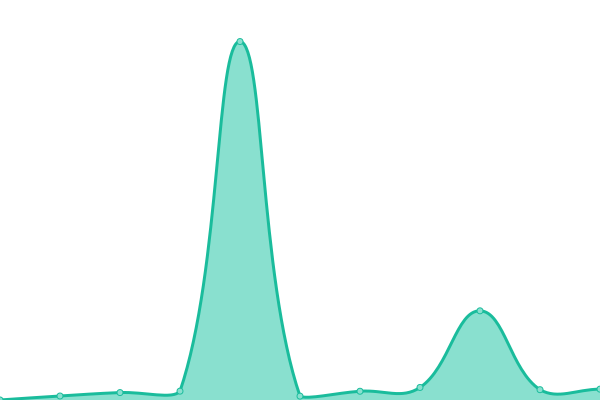

# [📈 Live Status](https://bipuldey19.github.io/pinger): <!--live status--> **🟧 Partial outage**

This repository contains the open-source uptime monitor and status page for [Bipul Dey](https://bipuldey.com), powered by [Upptime](https://github.com/upptime/upptime).

With [Upptime](https://upptime.js.org), you can get your own unlimited and free uptime monitor and status page, powered entirely by a GitHub repository. We use [Issues](https://github.com/bipuldey19/pinger/issues) as incident reports, [Actions](https://github.com/bipuldey19/pinger/actions) as uptime monitors, and [Pages](https://bipuldey19.github.io/pinger) for the status page.

<!--start: status pages-->
<!-- This summary is generated by Upptime (https://github.com/upptime/upptime) -->
<!-- Do not edit this manually, your changes will be overwritten -->
<!-- prettier-ignore -->
| URL | Status | History | Response Time | Uptime |
| --- | ------ | ------- | ------------- | ------ |
|  [File Stream Bot](https://filestream.bymirrorx.eu.org/) | 🟥 Down | [file-stream-bot.yml](https://github.com/bipuldey19/pinger/commits/HEAD/history/file-stream-bot.yml) | 

 618ms
     
 | 

<a href="https://bipuldey19.github.io/pinger/history/file-stream-bot">1.48%</a>
    

|  [File to Link Bot](https://filetolink.bymirrorx.eu.org/) | 🟥 Down | [file-to-link-bot.yml](https://github.com/bipuldey19/pinger/commits/HEAD/history/file-to-link-bot.yml) | 

 571ms
     
 | 

<a href="https://bipuldey19.github.io/pinger/history/file-to-link-bot">0.00%</a>
    

|  [Open Subtitles API](https://opensubtitles.bymirrorx.eu.org/) | 🟩 Up | [open-subtitles-api.yml](https://github.com/bipuldey19/pinger/commits/HEAD/history/open-subtitles-api.yml) | 

 2048ms
     
 | 

<a href="https://bipuldey19.github.io/pinger/history/open-subtitles-api">100.00%</a>
    

|  [Bangla Plex API](https://banglaplexapi.bymirrorx.eu.org/popular/) | 🟥 Down | [bangla-plex-api.yml](https://github.com/bipuldey19/pinger/commits/HEAD/history/bangla-plex-api.yml) | 

 2910ms
     
 | 

<a href="https://bipuldey19.github.io/pinger/history/bangla-plex-api">67.34%</a>
    

|  [Ad-Free Embedded Video Player API](https://videoadblocker.glitch.me/) | 🟩 Up | [ad-free-embedded-video-player-api.yml](https://github.com/bipuldey19/pinger/commits/HEAD/history/ad-free-embedded-video-player-api.yml) | 

 1982ms
     
 | 

<a href="https://bipuldey19.github.io/pinger/history/ad-free-embedded-video-player-api">100.00%</a>
    

|  [M3u Hosting](https://freeiptv25.testgmail3.repl.co/) | 🟩 Up | [m3u-hosting.yml](https://github.com/bipuldey19/pinger/commits/HEAD/history/m3u-hosting.yml) | 

 342ms
     
 | 

<a href="https://bipuldey19.github.io/pinger/history/m3u-hosting">100.00%</a>
    

<!--end: status pages-->

[**Visit our status website →**](https://bipuldey19.github.io/pinger)

## 📄 License

- Powered by: [Upptime](https://github.com/upptime/upptime)
- Code: [MIT](./LICENSE) © [Bipul Dey](https://bipuldey.com)
- Data in the `./history` directory: [Open Database License](https://opendatacommons.org/licenses/odbl/1-0/)
